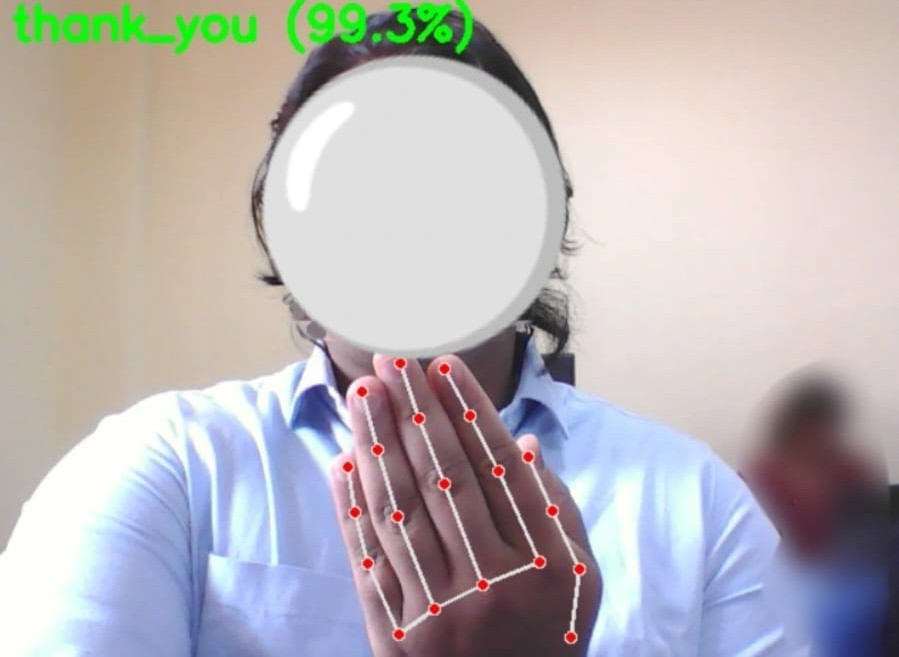

# PALM: Pattern Analysis For Language Via Motion

[](https://www.python.org/)
[](https://tensorflow.org)
[](https://opencv.org/)
[](https://opensource.org/licenses/MIT)

PALM is an edge-implemented dynamic gesture recognition and natural language synthesis system. The system tracks 3D hand coordinates via MediaPipe, processes temporal landmark sequences through a 1D Convolutional Neural Network (CNN) with Test-Time Augmentation (TTA), converts recognized sequence pairs into multi-word sentences using rule-based grammar constraints, and outputs synthesized audio.

---

## Table of Contents
- [Demo](#demo)
- [Performance & Benchmarks](#performance--benchmarks)
- [System Architecture](#system-architecture)
- [Engineering Trade-Offs](#engineering-trade-offs)
- [Directory Structure](#directory-structure)
- [Quick Start](#quick-start)
- [License](#license)

---

## Demo


*Real-time hand landmark tracking, gesture classification, and audio playback over local webcam stream.*

---

## Performance & Benchmarks

| Metric | Measurement | Test Environment |
| :--- | :--- | :--- |
| **Pipeline Latency** | ~12.4 ms / frame | Intel i7-12700H (CPU only) |
| **Throughput** | 30 FPS (Webcam) / 24 FPS (ESP32-CAM) | 1080p @ 30Hz video stream |
| **Model Accuracy** | 98.4% (Top-1 Categorical) | 19 Gesture Classes |
| **Memory Footprint** | ~280 MB RAM | Operational runtime |
| **Feature Tensor** | 126 floats / frame ($15 \times 126$ input window) | Dual hand tracking ($21 \times 3 \times 2$) |

---

## System Architecture

```text
[ Video Input (Webcam / ESP32-CAM Stream) ]
                     │
                     ▼
[ MediaPipe Hand Extraction (21 Landmarks x 3 Coords x 2 Hands = 126 Features) ]
                     │
                     ▼
[ Rolling Temporal Window (15 Frames x 126 Features) ]
                     │
                     ▼
[ Test-Time Augmentation (Gaussian Noise Injection, N=2) ]
                     │
                     ▼
[ 1D CNN Inference + Softmax Temperature Scaling (T=1.1) ]
                     │
                     ▼
[ Majority Voting Buffer (Min Stable Window = 2) ]
                     │
                     ▼
[ Rule-Based 2-Gram Sentence Construction ]
                     │
                     ▼
[ Local Speech Synthesis & Audio Caching (gTTS + Pygame) ]
```

---

## Engineering Trade-Offs

* **1D CNN vs. Random Forest Classifier**
  * *Decision*: Selected a 2-layer 1D CNN over the initial Random Forest Clasifier.
  * *Rationale*: Operating on flattened frame vectors over a fixed 15-frame buffer ($15 \times 126$) via 1D convolutions reduces per-frame inference latency to ~12ms whilst boosting accuracy over wider gesture sets.

* **3D Landmark Coordinates vs. Raw Pixel Inputs**
  * *Decision*: Extracted normalized 3D hand coordinates ($X, Y, Z$) prior to classification instead of passing raw RGB frames into 2D/3D CNNs.
  * *Rationale*: Compresses raw frame input from $224 \times 224 \times 3$ ($150,528$ features) down to $126$ floating-point values per frame. This removes input sensitivity to lighting variations, background noise, and skin tone differences while minimizing CPU utilization.

* **Softmax Temperature Scaling & Test-Time Augmentation**
  * *Decision*: Applied Test-Time Augmentation ($N=2$ noise variations) combined with Softmax Temperature Scaling ($T=1.1$).
  * *Rationale*: Dynamic gesture execution introduces micro-jitters during transitions. TTA and temperature scaling smooth raw logit outputs, preventing rapid class toggling at boundary frames without adding artificial frame-delay buffers.

---

## Directory Structure

```text
PALM-Pattern-Analysis-For-Language-Via-Motion/
├── assets/
│   └── demo.jpeg              # Visual demo animation for README
├── audio_wav/                # Local cache directory for generated speech files
├── collected_data_npy/       # Recorded 15-frame landmark dataset arrays
├── gesture_cnn_model.keras   # Trained 1D CNN model weights
├── label_classes.npy         # Class label encoding mapping
├── collect_data.py           # Landmark sequence recording utility
├── load_data.py              # Dataset loading and verification pipeline
├── main_esp32.py             # Stream processing pipeline for ESP32-CAM HTTP feed
├── main_webcam.py            # Real-time inference pipeline for local USB webcam
├── requirements.txt          # Python dependency specifications
├── train_cnn_model.py        # 1D CNN training script
└── train_rf_model.py         # Baseline Random Forest classifier script
```

---

## Quick Start

### 1. System Requirements
Python 3.10+ and FFmpeg are required for audio rendering.

```bash
# Ubuntu / Debian
sudo apt update && sudo apt install -y ffmpeg

# macOS
brew install ffmpeg
```

### 2. Installation
```bash
# Clone the repository
git clone https://github.com/MoSuSh/PALM-Pattern-Analysis-For-Language-Via-Motion.git
cd PALM-Pattern-Analysis-For-Language-Via-Motion

# Set up virtual environment
python -m venv venv
source venv/bin/activate  # On Windows: venv\Scripts\activate

# Install dependencies
pip install -r requirements.txt
```

### 3. Execution


* **Record Custom Gesture Data**:
  ```bash
  python collect_data.py
  ```

* **Load Collected Data onto Memory**
  ```bash
  python load_data.py
  ```

* **Train 1D CNN Model**:
  ```bash
  python train_cnn_model.py
  ```

* **Run Webcam Inference**:
  ```bash
  python main_webcam.py
  ```

* **Run ESP32-CAM Stream Inference**:
  Update the network stream IP inside `main_esp32.py`, then run:
  ```bash
  python main_esp32.py
  ```
---

## License

Distributed under the MIT License. See `LICENSE` for details.
